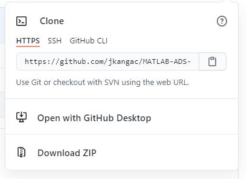
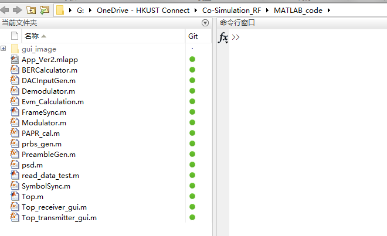
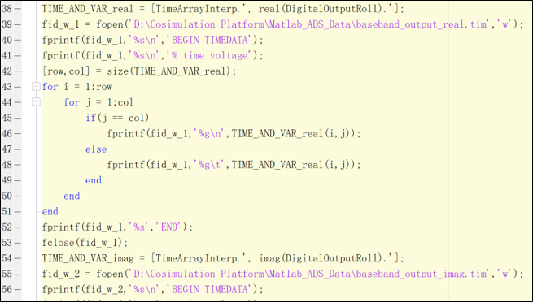
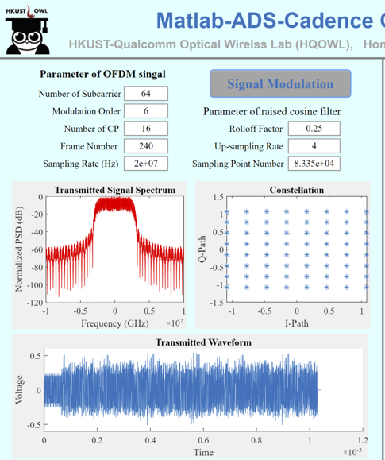
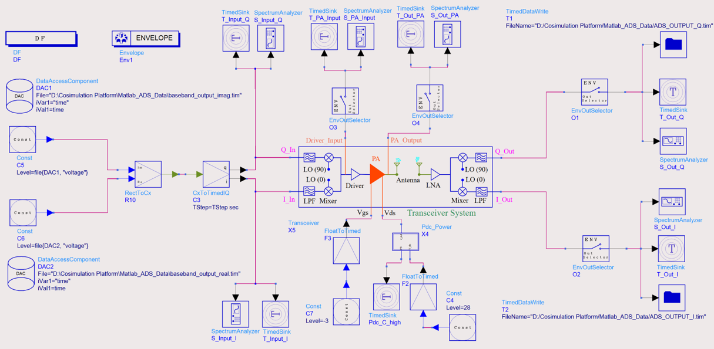
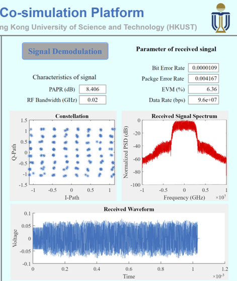

# MATLAB-ADS-Cadence Co-Simulater

## 1. Motivation
&#8194;&#8194;This platform is used for radio frequency system simulation. MATLAB is used to simlulate the baseband part of the system. The signal with both single or multi subcarries can be generated by the MATLAB code with adjustable parameters. The generated signal can be transmitted to ADS or cadence as the input of the frontend circuit. Then the simulation result from ADS or cadence is returned to MATLAB again for decoding and demodulation. 
&#8194;&#8194;The constellation, signal spectrum and waveform in time domain from both transmitter and receiver can be obtained. And the peak to average power ratio, bit error rate can be calculated automatically by the simulator.
&#8194;&#8194;The structure and the usage of the simulator is shown below.

## 2. Enviroment Requirment
* MATLAB 2019b or newer version
* ADS2015 or newer version
* Cadence

## 3. Project Structure
CO-SIMULATION_RF 
├─ADS_workspace: ADS project. 
├─Interchage_files: This file is used store the files generated by MATLAB and ADS. The data exchanges between different tools through these files. The files can be generated by the source code automatically. 
├─MATLAB_code: MATLAB source code for backend and frontend. 
│  └─gui_image: the images used for GUI. 
└─Picture: The picture files used in readme file. 

## 4. How to use the Co-Simulation Platform
1. Download the zip file and unzip or git clone the whole project to a specific location.

2. Open the MATLAB and locate the working path of MATLAB to "your_project_location\Co-Simulation_RF\MATLAB_code". "your_project_location" is the path your store the downloaded project. e.g. "G:/OneDriver - HKUST Connect" is my project location.

3. Check the interchange files path in "Top_receiver_gui.m" and "Top_transmitter_gui.m" are consistent with your downloaded location.

4. Run the "App_Ver2.mlapp" in the MATLAB then you can see the GUI of the Co-Simulation Platform. You can change the parameters of the generated signal such as the number of the subcarriers, modulation scheme and so on. 

 5. Then click "Signal Modulation" button. Wait for a second, the spectrum, constellation and waveform of the transmitted signal are shown in the window.
 

 6. Then open the ADS project. Check the interchange file location to confirm they are consistent with your downloaded location. Then run the ADS simulation.
 

 7. After the ADS simulation is completed. Back to the MATLAB GUI. Click "Singal Demodulation" button. Then the spectrum, constellation, waveform and the calculated parameters of the received signal is shown in the window.
 
 
 8. Now you can replace your own design to the example project for the Co-Simulation!